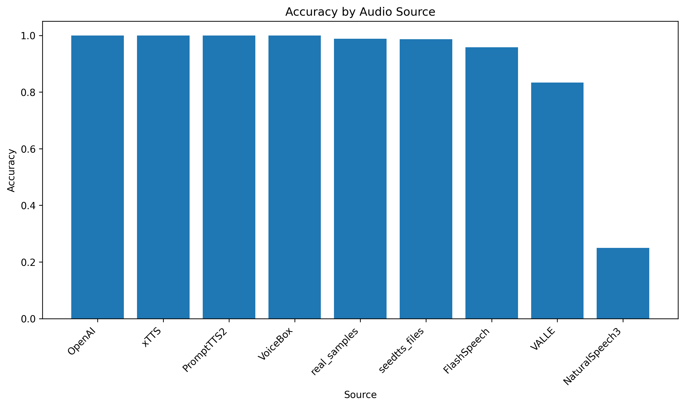

# DeepFake Audio Detector

## Overview

This project implements a **deepfake audio detector** by fine-tuning a pretrained speech model to classify audio as either **real (human speech)** or **synthetic (AI-generated)**.

The goal is to explore how machine learning can help identify synthetic voice content and serve as a **risk signal** in scenarios like impersonation scams or misleading audio.

---

## Approach

- **Model:** Wav2Vec2 (`facebook/wav2vec2-base`)
- **Task:** Binary classification (real vs synthetic)
- **Audio preprocessing:**
  - Resampled to 16 kHz  
  - Fixed-length clips (truncated/padded)

The model was fine-tuned on labeled audio data and evaluated using standard classification metrics.

---

## Dataset

This project uses the **Audio Deepfake Detection Dataset (Kaggle)**.

- ~4,400 audio samples  
- Balanced real vs synthetic  
- Synthetic audio generated from multiple sources including:
  - OpenAI
  - xTTS
  - seedtts
  - FlashSpeech
  - NaturalSpeech3
  - PromptTTS2
  - VALLE
  - VoiceBox

---

## Results

| Metric     | Value   |
|------------|--------|
| Accuracy   | 98.9%  |
| Precision  | 99.7%  |
| Recall     | 98.2%  |
| F1 Score   | 98.9%  |

---

## Source-Level Performance

Performance was evaluated across individual synthetic sources.



---

## Limitations

- Dataset is synthetic and limited in diversity  
- May learn generator-specific artifacts
- Disporporational samples from deepfake sources
- Not guaranteed to generalize to unseen or real-world deepfake audio  

This should be viewed as a **prototype risk detector**, not a production system.

---

## How to Run

### Install dependencies
```bash
pip install transformers torchaudio librosa scikit-learn matplotlib
```

### Run
Use the provided notebook or training script to:
- train the model  
- evaluate performance  
- generate figures  
